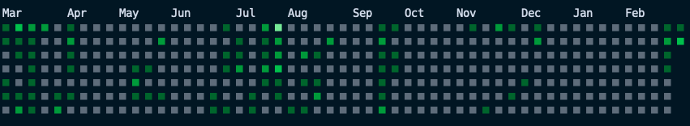

# All Contributions CLI

Allows you to view your contribution graph for multiple Git servers combined, in your CLI.

### Configuration

Provide your tokens, server address, and color preferences in your local `.env` file.
A [color scheme](src/colors.rs) can be set using the `COLOR_SCHEME` variable.

### Current support

|           | Supported | Environment Variables                              |
| --------- | --------- | -------------------------------------------------- |
| Github    | ✅        | `GITHUB_TOKEN`, `GITHUB_USERNAME`                  |
| GitLab    | ✅        | `GITLAB_TOKEN`, `GITLAB_SERVER`, `GITLAB_USERNAME` |
| Gitea     | ❌        |
| Codeberg  | ❌        |
| BitBucket | ❌        |
